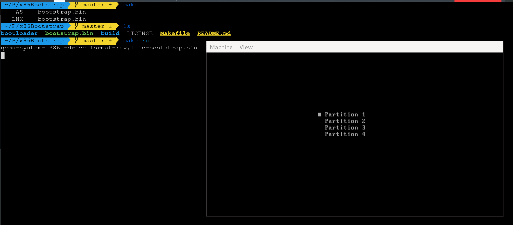

# x86Bootstrap

x86 MBR bootloader wroten in GNU assembly syntax.

[Some really good explaination...](https://wiki.osdev.org/MBR_(x86))

Multiboot handled by a menu from which you can boot on the 4 MBR partitions.

# Dependencies

You can compile the only source file with your hands if make is missing.

  * `make` (dev under V4.3)

  * `as` (dev under V2.34)

  * `ld` (dev under V2.34)

# Build

`make`

# Install

`dd if=bootstrap.bin of=/dev/sdX bs=446 count=1`

## Master Boot Record Format

Offset| Size (bytes) | Description
------|--------------|-------------------
0x000 |  440         |  MBR Bootstrap (flat binary executable code)
0x1B8 |  4           |  Optional "Unique Disk ID / Signature"2
0x1BC |  2           |  Optional, reserved 0x00003
0x1BE |  16          |  First partition table entry
0x1CE |  16          |  Second partition table entry
0x1DE |  16          |  Third partition table entry
0x1EE |  16          |  Fourth partition table entry
0x1FE |  2           |  (0x55, 0xAA) "Valid bootsector" signature bytes

## Traditional MBR steps

* relocate itself to 0x0000:0x0600
* examine the byte at offset 0x1be, 0x1ce, 0x1de, and 0x1ee to determine the active partition
* load only the first sector of the active partition (which is expected to contain a DOS bootsector) to 0x0000:0x7c00 (hence the previous relocation)
* set SI
* jump to 0x7c00 -- transferring control to the DOS bootsector.

## Partition Table Entry

Offset1| Size (bytes) | Description
-------|--------------|--------------------------------------
0x00   |1             | Drive attributes (bit 7 set = active or bootable)
0x01   |3             | CHS Address of partition start
0x04   |1             | Partition type
0x05   |3             | CHS address of last partition sector
0x08   |4             | LBA of partition start
0x0C   |4             | Number of sectors in partition

## Runtime

# Epilogue

Just for the fun.

Feel free to fork, use, improve.
